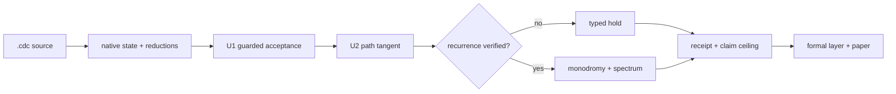

<p align="center">
  <picture>
    <source media="(prefers-color-scheme: dark)" srcset="assets/identity/mobius-u-code-sigil-dark.svg">
    <source media="(prefers-color-scheme: light)" srcset="assets/identity/mobius-u-code-sigil.svg">
    
  </picture>
</p>

# BiDi

<p align="center">
  <strong>Universal Operator System</strong><br>
  Source · state · guarded execution · recurrence · evidence
</p>

BiDi is an executable research system for expressing controlled state
transitions, running them through the native Coherence-Delta Calculus (CDC)
kernel, and producing receipt-bound U1 and U2 analyses.

> **Universal Operator System** is a bounded repository-level description. It
> names the integration of language, runtime, operators, verification, formal
> mirrors, and instruments. It does not claim a universal physical law, quantum
> implementation, empirically validated ontology, or the operator-algebra
> meaning of “operator system.”

**[Understand](UNIVERSAL_OPERATOR_SYSTEM.md) · [Run](#run) ·
[Verify](#verify) · [Paper](paper/arxiv/main.pdf)**

## The system at a glance

- **BiDi** is the integrated source, execution, and evidence system in this repository.
- **CDC** is its formal language, native kernel, and canonical `.cdc` source contract.
- **U1** guards lifted-cover acceptance and effect enactment.
- **U2** differentiates an accepted path and gates return analysis on independently verified recurrence.
- **Möbius** is an embodied reference instrument over runtime receipts, not a source of authority.
- **`𝒰_` / `𝒰`** denote the complete executable operator sigil and its reduced mathematical body; they are notation, not required CLI input.



Every arrow may hold without manufacturing the artifact to its right. The
machine record, source digest, and gate determine authority; presentation does
not.

## Release truth

Version **0.3.0** is the current public release.

- `262/262 expectations`
- `20 terms · 22 rules · 16 invariants`
- `46 capabilities · 6 frameworks · 4831 native witnesses`
- `ABI 1.5`

Within the language/runtime/semantic execution boundary, the shipped
implementation is the native CDC parser, registry, reducer, receipts, U1/U2
analysis path, and unified `cdc` driver. Product surfaces, formal mirrors, and
paper arguments remain downstream explanatory surfaces over that executable
boundary.

## Run

The native path requires Python 3.10+, a C99 compiler, and BLAS/LAPACK (Apple
Accelerate on macOS is supported). The U2 gate builds the current runtime,
executes the canonical path, and exercises its adversarial fixtures:

```bash
git clone https://github.com/ETEllis/BiDi.git
cd BiDi

./scripts/verify_u2.sh --skip-formal
./build/u2/cdc_native_runtime stability framework_loop.cdc
```

The canonical source currently reports:

```text
U1             accepted
analysis       tangent
recurrence     held: recurrence-mode-mismatch
monodromy      not emitted
multipliers    not emitted
```

This is a successful, informative hold. The two-turn lifted-cover criterion
passes, while latch mode, belief, prior, and unwrapped phase do not all return.
The complete authoritative record is the output line beginning `u2-json=`.

The positive relative-return calibration is explicit and separate:

```bash
./build/u2/cdc_native_runtime stability \
  tests/fixtures/u2/u720_true_relative_marginal.cdc
```

It declares the endpoint restoration `rho(theta) = theta - 4 pi` and complete
`D rho = I`. In that bounded fixture, `M_rel = I_13`. It earns a marginal
relative spectrum; it does not make the canonical loop recurrent or establish
physical stability.

## Verify

The complete repository gate checks the source contract, native runtime,
generated artifacts, durable store, U1/U2 receipts, counterexamples, sanitizer
and concurrency paths, finite formal mirrors, product-source integrity, and the
paper:

```bash
./scripts/verify.sh

# CI-equivalent strict gate; also requires Lean, Rocq/Coq, and Tectonic
./scripts/verify.sh --require-formal
```

The verification unit is always:

```text
(scope, maturity, verdict, receipt-or-obligation)
```

A declaration is not an implementation. A passing finite proof is not a
continuous theorem. A numerical fixture is not a physical law. A screen or
green counter is not an execution receipt.

### Current release boundary · 0.3.0

- Grammar-1 source and native contract: **accepted; executed and adversarially verified**.
- Canonical `framework_loop.cdc` U1: **accepted** for guarded lifted-cover closure.
- Canonical U2 tangent: **accepted** over a source-bound 13-coordinate manifest.
- Canonical complete-state recurrence: **held** with `recurrence-mode-mismatch`.
- Canonical monodromy and multipliers: **not authorized and not emitted**.
- Isolated `4 pi` relative-return fixture: **accepted, marginal** with explicit restoration.
- Carrier, event-order, cone-role, aperture, sheet, and barrier facts: **mechanized finite** in Lean and Rocq.
- Physical and quantum interpretations: **exploratory and not evidenced by this artifact**.

See the [verification obligation matrix](VERIFICATION_OBLIGATION_MATRIX.md) for
the claim-to-receipt inventory and [U2 semantics](docs/u2/U2_SEMANTICS.md) for
the normative recurrence contract.

## CDC: the formal and executable kernel

CDC has exactly three primitive reductions:

- `flow(d)` performs synchronous continuous phase evolution;
- `commit(m)` quantizes to balanced ternary and enforces the nonnegative-prefix barrier;
- `nest(parent, child)` performs the audited cross-scale belief/prior exchange.

Trace windows, frameworks, persistence, U1, and U2 are derived jobs over those
reductions. The language may specify richer amplitude, delay, projection,
plasticity, and localized-event semantics than native realization v1 executes;
unconsumed declarations remain public obligations rather than hidden dynamics.

```cdc
field loop-cover-field dt=0.125 gain=0.0 deadband=0.5
module loop-cover field=loop-cover-field belief=0.0 prior=0.0
cell loop-cover.phase module=loop-cover theta=0.0 amplitude=1.0 omega=6.283185307179586

universal loop-u720 frame=agent cover-cell=loop-cover.phase cover=double ...
orbit loop-u720-full universal=loop-u720 coordinates=all quotient=none tolerance=0.000001
variational loop-u720-tangent orbit=loop-u720-full
spectrum loop-u720-spectrum variational=loop-u720-tangent
```

The unified `cdc` driver exposes verification, execution, stability, build,
installation, and trusted-local package commands. Package installation is
journaled and atomic; `cdc x` re-digests installed members before execution but
is not a hostile-package sandbox.

## U1, U2, and polarity

U1 accepts only when reciprocal channel roles, double-cover restoration,
declared holonomy, local commits, record/decision agreement, and effect gating
agree. It earns lifted-cover closure—not automatic recurrence of the complete
runtime state.

U2 closes a coordinate manifest over the exact accepted path, differentiates
the executed maps in source order, records continuous and discrete endpoints,
and verifies full or explicitly restored recurrence before it constructs a
monodromy operator or emits characteristic multipliers. A missing spectral
backend produces a typed hold rather than invented eigenvalues.

Polarity is system-wide as **apertured oriented reciprocity** where a contract
declares it: carrier inversion exchanges `-1` and `+1` while fixing `0`;
receptive/radiant roles may exchange; path orientation may reverse; and
double-cover sheet parity changes after one turn and restores after two. These
are related but distinct transformations. The system does not force them into
one binary symmetry, and it does not promote their verified software behavior
into a universal physical polarity law. The exact scope and counterexamples
are recorded in the [polarity audit](docs/u2/POLARITY_AUDIT.md).

## Architecture and evidence

Start with the [Universal Operator System](UNIVERSAL_OPERATOR_SYSTEM.md) for the
whole-to-parts model and compatibility boundary. Then use the route appropriate
to the question:

- [CDC language reference](CDC_LANGUAGE.md) — syntax and source contract.
- [Formal semantic spine](FORMAL_SEMANTIC_SPINE.md) — specification versus audited realization.
- [Frameworks](FRAMEWORKS.md) — H1–H6 source-level task vocabulary.
- [Bridge runtime](BRIDGE_RUNTIME.md) — bridge generation and runtime behavior.
- [Verification matrix](VERIFICATION_OBLIGATION_MATRIX.md) — claims, receipts, counterexamples, and open obligations.
- [U2 semantics](docs/u2/U2_SEMANTICS.md) — tangent, recurrence, restoration, and spectral authority.
- [Paper](paper/arxiv/main.pdf) and [source](paper/arxiv/main.tex) — CDC formalization and release argument.

## Instruments and research lanes

[CDC Studio and the web evidence console](ui/README.md) are operator instruments
over runtime receipts. Their controls and visual states do not outrank source,
runtime, or receipt evidence.

The [Reference-Frame Topological Coherence lane](docs/rftc/VERIFICATION_OBLIGATION_MATRIX.md)
is deterministic classical local machinery for synchronization, winding,
provenance, admissibility, and record closure. It is not a deployed multi-host
session, physical qubit, entanglement, nonlocality, or quantum advantage.

Möbius identity construction, renders, motion, and provenance live under
[identity documentation](docs/identity/README.md). The interactive
[one-turn/two-turn motion study](demo/mobius-identity.html) is a reference
instrument. **Möbi𝒰s remains a proposed product-linked identity**, not the name
of the formal kernel or a replacement for the BiDi system.

## Compatibility

The system-level identity does not rename the package, executable, file format,
ABI, C symbols, or formal namespaces. Existing automation continues to use
`bidi-coherence-delta-calculus`, `cdc`, `.cdc`, and the established CDC symbols.
Historical specifications remain versioned provenance, not current release
authority.

## Citation and license

BiDi is released under the [MIT License](LICENSE). Cite the repository through
[CITATION.cff](CITATION.cff) and cite the CDC paper for the formal kernel and
U1/U2 release argument.
