<p align="center">
  <picture>
    <source media="(prefers-color-scheme: dark)" srcset="assets/identity/renders/mobius-wordmark-static.png">
    <source media="(prefers-color-scheme: light)" srcset="assets/identity/mobius-u-wordmark-light.svg">
    
  </picture>
</p>

# BiDi Coherence-Delta Calculus

<p align="center">
  <strong>A native language and runtime for systems that flow continuously,
  commit discretely, and preserve coherence across nested reference frames.</strong>
</p>

BiDi Coherence-Delta Calculus (CDC) is both:

- a compact formal kernel built from `FLOW`, `COMMIT`, and `NEST`; and
- an executable `.cdc` language, native runtime, durable store, package
  toolchain, typed receipt surface, and reference-frame control-plane
  experiment.

The calculus supplies the decision semantics. The toolchain makes those
semantics executable and testable. Downstream systems such as Memory Manifold
and Superposition consume the boundary without owning or silently weakening it.

## Current status

- **Package:** `0.2.4`
- **Native ABI:** `1.4`
- **CDC / Memory Manifold interface:** `1.3.0`
- **Implementation baseline:** `79a508aa1441877aaeeafe415ef285983b186388`

The current main line includes:

- canonical Grammar-1 parsing with differential legacy-oracle coverage;
- one native `cdc` driver for parse, verify, run, test, build, install, and
  trusted-local execution;
- native `FLOW`, `COMMIT`, and `NEST` reducers plus trace/window, council,
  bridge, universal-closure, and framework surfaces;
- a crash-safe, corruption-refusing, replayable event store with snapshot,
  compact, fencing, same-process and cross-process coordination;
- typed effect receipts, per-check parity vectors, deterministic verdicts, and
  source/binary provenance;
- deterministic proof-carrying bundles, journaled installs, and `cdc x`;
- Lean and Rocq/Coq finite-carrier mirrors plus a paper compiled in the required
  gate;
- the seven-witness classical RFTC crucible;
- six RFTC language forms and an ABI 1.4 authenticated **local** control plane.

PRs #3-#8 are merged into that baseline. The required Linux
native/formal/paper lane and macOS
native/CDC Studio lane were green at their accepted heads.

## System flow

```mermaid
flowchart LR
    Source[".cdc source"] --> Front["Canonical frontend<br/>parse + diagnose + serialize"]
    Front --> AST["Typed AST / ABI 1.4"]

    AST --> Runtime["Native runtime"]
    Runtime --> Flow["FLOW<br/>continuous evolution"]
    Runtime --> Commit["COMMIT<br/>guarded ternary closure"]
    Runtime --> Nest["NEST<br/>reference-frame coupling"]

    Flow --> State["Live runtime state"]
    Nest --> State
    State --> Evidence["Trace, evidence, policy,<br/>closure obligations"]
    Evidence --> Commit

    Commit -->|accepted| Store["cdc_store<br/>sealed transaction"]
    Commit -->|held / violated| Zero["zero durable mutation"]
    Store --> Receipt["Typed receipt + closure witness"]
    Store --> Replay["Replay / attest / snapshot / compact"]
    Replay --> State

    AST --> Build["cdc build"]
    Build --> Bundle["proof-carrying bundle"]
    Bundle --> Install["cdc install<br/>journaled + crash-safe"]
    Install --> X["cdc x<br/>trusted-local-only"]
    X --> Runtime

    Proof["Native finite checker<br/>Lean + Rocq/Coq"] --> Runtime
    Oracle["Frozen cdc_boot.py<br/>CI-only differential oracle"] -. parity .-> Front
```



Open the [full architecture flow](docs/architecture/CDC_SYSTEM_FLOW.md) or the
[static diagram](assets/architecture/cdc-system-flow.svg).

## Semantic center

CDC has three foundational reductions:

```text
FLOW(d)        continuous evolution for duration d
COMMIT         evented, guarded balanced-ternary closure
NEST(frame)    bidirectional coupling across reference frames
```

Everything else is derived or supporting structure:

- `bidiγΔ` carries context downward and evidence upward across frames;
- trace/window defines bounded observation without a privileged global
  observer;
- the Universal Operator `𝒰_` closes a lifted return over FLOW/COMMIT/NEST;
- durable persistence places accepted records behind the same COMMIT barrier;
- RFTC gives the reference-frame/topology/authority/transport extension a
  classical, falsifiable runtime contract.

`HOLD` is the zero-valued result of an unresolved or inadmissible decision. It
is not failure and it writes nothing. `FAIL` is a typed contract or execution
violation. These outcomes are never merged into a generic pass count.

## Install and verify

Requirements:

- Python 3.10 or newer for the frozen differential oracle and package wrapper;
- a C compiler;
- Lean, Rocq/Coq, and Tectonic for the complete formal/paper gate.

```bash
git clone https://github.com/ETEllis/BiDi-Coherence-Delta-Calculus.git
cd BiDi-Coherence-Delta-Calculus

./scripts/verify.sh
./scripts/verify.sh --require-formal
```

Build the native driver:

```bash
./scripts/verify.sh
build/cdc version
build/cdc verify --parse kernel.cdc
build/cdc test --gate kernel.cdc
```

The verification gate is the repository authority. It covers native builds,
sanitizers, parser differentials, durable-store crash/corruption/race matrices,
package mutation and kill matrices, formal proofs, generated artifacts, the
paper, and the macOS product lane in CI.

## Language surface

The checked Grammar-1 surface includes:

```text
kernel term rule invariant law capability framework witness
field module cell channel guard counter
flow commit nest trace measure policy bridge
compile interpret proof council deliberate evolve universal
store persist
frame reduce complex topology authority transport
expect end
```

See [`CDC_LANGUAGE.md`](CDC_LANGUAGE.md) for the grammar and
[`FORMAL_SEMANTIC_SPINE.md`](FORMAL_SEMANTIC_SPINE.md) for the AST, runtime
state, reduction relation, and invariant mapping.

## Native toolchain

| Command | Current contract |
| --- | --- |
| `cdc verify --parse` | strict frontend and typed diagnostic path |
| `cdc run` | fused single-process executor over one parsed source |
| `cdc test --gate` | typed policy; undeclared HOLD and zero-run both fail |
| `cdc build` | deterministic proof-carrying bundle with grammar/ABI/source/artifact bindings |
| `cdc install` | capture-once, journaled, crash-safe install on `cdc_store` |
| `cdc x` | re-verifies installed members and executes through the fused runtime |

`cdc x` is deliberately **trusted-local-only**. It is not a sandbox and has no
network package source. CT5 must add a sealed capability environment and
hostile-package counterexamples before that boundary changes.

## Durable state

`store` and `persist` are language forms. A durable append reaches `cdc_store`
only through the same balanced-ternary guard as an in-memory COMMIT:

```cdc
store journal dir=.cdc/state mode=open
persist save store=journal op=append module=council
```

The store distinguishes three failure classes:

- a legitimate unsealed tail may recover;
- corruption in committed history fails closed and preserves evidence;
- I/O faults remain I/O faults and never masquerade as recoverable tails.

Its current gates include:

- every-byte mutation sweeps over committed records and snapshots;
- in-process and actual `SIGKILL` crash matrices;
- atomic generation transitions for snapshot/compact;
- stale-writer fencing;
- same-application and cross-process serialization;
- deterministic release-window and concurrent-install counterexamples.

Integrity is content-addressed. Public-key signing and an externally retained
anchor remain open; a party able to rewrite both the store and its only local
anchor is outside the current guarantee.

## RFTC: reference-frame topological coherence

RFTC is the bounded classical lane between phase flow and guarded closure.
Its entry crucible tests seven mechanisms independently:

1. synchronization onset;
2. oriented winding-sector preservation;
3. distinct microstates behind one macro boundary;
4. bidirectional macro/micro recovery;
5. per-packet admissibility separate from aggregate drive;
6. recoverable redundant record closure;
7. a causal cut that rejects ordinary communication as nonclassical evidence.

```bash
./scripts/verify_rftc.sh
build/rftc/rftc_crucible --profile rapid \
  --json build/rftc/verdict-rapid.json \
  --csv build/rftc/metrics-rapid.csv
```

The six source forms are `frame`, `reduce`, `complex`, `topology`, `authority`,
and `transport`. ABI 1.4 implements canonical keyed-BLAKE3 envelopes, scoped
leases, causal/replay defense, and serialized exactly-once local supervisor
admission.

That is shared-key local authenticity—not Ed25519/mTLS identity, a deployed
network, recursive cross-host logical cells, quantum behavior, or quantum
advantage. The exact claim boundary is in
[`docs/rftc/RELATIONAL_RECORD_CLOSURE.md`](docs/rftc/RELATIONAL_RECORD_CLOSURE.md).

## Formal and executable evidence

| Status | Meaning | Current examples |
| --- | --- | --- |
| proved / exhaustive | mechanized or finite-complete | `n=6` carrier counts, finite algebra, double-cover sheet parity |
| runtime-checked | executed in required gates | parser, reducers, store, package lifecycle, RFTC control plane |
| witnessed | native `.cdc` declaration linked to executable evidence | semantic registry, frameworks, trace/window, Universal Operator |
| queued | named obligation, not a current claim | continuous-flow theorem, arbitrary `n=3k`, sealed CT5, cross-host RFTC |

The finite carrier census is:

```text
total 729
prefix-admissible 267
localized 51
saturated 20
Catalan closures 5
```

Claim-to-evidence-to-proof mapping lives in
[`VERIFICATION_OBLIGATION_MATRIX.md`](VERIFICATION_OBLIGATION_MATRIX.md).

## Relationship to Memory Manifold and Superposition

- **Memory Manifold** consumes the canonical store and decision boundary for
  append-only memory. It owns memory envelopes, traversal, derived geometry,
  and consolidation. Its current integration must still prove that callers
  cannot mint or bypass commit authority.
- **Superposition** consumes native decision parity for guarded speculative
  collapse. It owns encrypted distributed state, networking, placement,
  reconstruction, and effect realization.
- **CDC remains independent of either product.** The same language, store, and
  decision semantics can be embedded by unrelated runtimes.

The pinned cross-repository interface is
[`CDC_MEMORY_MANIFOLD_INTERFACE.md`](CDC_MEMORY_MANIFOLD_INTERFACE.md).

## Paper and visual surfaces

- arXiv source: [`paper/arxiv/main.tex`](paper/arxiv/main.tex)
- paper build guide: [`paper/arxiv/README.md`](paper/arxiv/README.md)
- architecture flow: [`docs/architecture/CDC_SYSTEM_FLOW.md`](docs/architecture/CDC_SYSTEM_FLOW.md)
- executable web console: [`ui/web/console/index.html`](ui/web/console/index.html)
- RFTC evidence UI: [`experiments/rftc/ui/index.html`](experiments/rftc/ui/index.html)
- 64-state bridge: [`assets/bridge64-grid.svg`](assets/bridge64-grid.svg)

## Open boundaries

- `cdc x` remains trusted-local until CT5.
- RFTC transport is a local shared-key wire proof, not deployed identity or
  cross-host consensus.
- Ed25519 signing, key rotation, and external rollback anchoring remain open.
- `package.cdc`, versioned coexistence, and lockfiles remain open.
- unbounded `cycles=N`, continuous proofs, broader fuzzing, and a self-hosted
  reducer remain open.
- `cdc_boot.py` is frozen as a CI-only differential oracle under Edward's
  Option A decision; deleting it requires a new explicit decision.
- PC6 remains hard-paused and is not touched by this repository.

## Repository map

- `runtime/` - native ABI, frontend, reducer, store, receipts, RFTC, toolchain
- `*.cdc` - native language programs and witness suites
- `formal/` - Lean and Rocq/Coq mirrors
- `docs/rftc/` - RFTC contracts and execution plan
- `docs/build/` - build state and append-only decisions
- `evidence/` - gate provenance and retained results
- `paper/arxiv/` - checked paper source
- `ui/` and `demo/` - inspectable product and replay surfaces

## License and citation

MIT. See [`LICENSE`](LICENSE). Citation metadata is in
[`CITATION.cff`](CITATION.cff).
