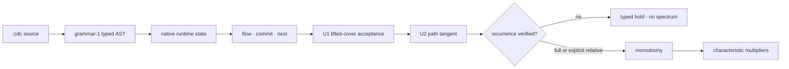

<p align="center">
  <picture>
    <source media="(prefers-color-scheme: dark)" srcset="assets/identity/renders/mobius-wordmark-static.png">
    <source media="(prefers-color-scheme: light)" srcset="assets/identity/mobius-u-wordmark-light.svg">
    
  </picture>
</p>

# BiDi Coherence-Delta Calculus

<p align="center">
  <strong>A native language for guarded hybrid state evolution and receipt-bound return analysis</strong><br>
  phase flow · balanced-ternary commit · nested exchange · lifted closure · recurrence-gated variation
</p>

BiDi Coherence-Delta Calculus (CDC) is a native `.cdc` language and executable
reference implementation for systems that combine continuous phase evolution,
guarded discrete commitment, nested reference frames, local observation, and
durable effects. Its semantic center is deliberately small: `flow`, `commit`,
and `nest` are the three primitive reductions. Trace windows, task frameworks,
the Universal Operator U1, and the variational Universal Operator U2 are derived
layers over those reductions.

Version **0.3.0** makes the claim boundary executable. U1 can accept a
lifted-cover closure without pretending the complete runtime state returned. U2
then differentiates that exact accepted path and independently checks recurrence
before it will construct a monodromy operator or emit characteristic
multipliers. A non-return is a typed result, not a missing success screen.

## What is earned now

CDC reports evidence maturity and execution verdict separately. `held` is not a
weak proof rung: a mechanism can be adversarially verified precisely because it
correctly refuses an unsupported result.

| Scope | Maturity | Verdict | Authority |
|---|---|---|---|
| grammar-1 source and native contract | executed + adversarially verified | accepted | `cdc_boot.py`, native registry parity, parser counterexamples |
| `framework_loop.cdc` U1 | executed + adversarially verified | accepted | reciprocal cones, 720-degree lifted-cover closure, record/decision equality, guarded enactment |
| `framework_loop.cdc` U2 tangent | executed + adversarially verified | accepted | source-bound coordinate manifest and `D U` receipt |
| `framework_loop.cdc` full recurrence | executed + adversarially verified | **held: `recurrence-mode-mismatch`** | latches, belief, prior, and lifted phase do not all return |
| canonical-loop monodromy and multipliers | not authorized | not emitted | recurrence gate |
| isolated `4 pi` relative-return fixture | adversarially verified | accepted, marginal | explicit endpoint restoration, complete `D rho`, real-Schur spectrum |
| finite carrier, event order, cone role, and sheet facts | mechanized finite | accepted | Lean and Rocq/Coq mirrors |
| physical or quantum interpretation | exploratory | not evidenced | requires domain state, units, calibration, alternatives, and discriminating experiments |

For any claim, read the tuple:

```text
(scope, maturity, verdict, receipt-or-obligation)
```

That prevents a declaration from becoming an implementation claim, a numerical
fixture from becoming a physical law, or an attractive product surface from
outrunning its source receipt.

## Five-minute path

Requires Python 3.10+, a C99 compiler, and the platform BLAS/LAPACK backend used
by the U2 real-Schur path. The strict formal gate additionally requires Lean,
Rocq/Coq, and Tectonic.

```bash
git clone https://github.com/ETEllis/bidi-coherence-delta-calculus.git
cd bidi-coherence-delta-calculus

./scripts/verify.sh
./build/cdc version
./build/cdc run framework_loop.cdc
./build/cdc stability framework_loop.cdc

# CI-equivalent formal, native, generated-artifact, UI-source, and paper gate
./scripts/verify.sh --require-formal
```

The canonical stability command currently returns:

```text
U1             accepted
analysis       tangent
recurrence     held: recurrence-mode-mismatch
monodromy      not emitted
multipliers    not emitted
```

The complete machine record is the line beginning `u2-json=`. Human-readable
lines are never the acceptance authority.

Editable Python-package installation remains available for the minimal
bootloader:

```bash
pip install -e .
```

## One semantic spine



Every higher layer remains a projection of the same object:

```text
.cdc source
  -> typed AST
  -> executable state and ordered itinerary
  -> primitive reductions
  -> acceptance and effect receipts
  -> tangent and recurrence receipts
  -> finite formal statements and open obligations
```

Within the language/runtime/semantic execution boundary, Python is limited to
`cdc_boot.py`, the declaration/expectation bootloader. The native grammar,
registry, reducer, toolchain, store, U1, and U2 implementations live in C and
consume the same `.cdc` source. Separate Blender asset-generation utilities
under `tools/` are outside that execution boundary.

## Primitive reductions: specified and executed

The calculus specifies a richer semantic target than native realization v1.
The distinction is intentional and public.

| Reduction | Calculus-level specification | Audited native v1 mutation |
|---|---|---|
| `flow(d)` | continuous state evolution with channel influence | one synchronous explicit phase map using `omega`, duration, field gain, channel weight, and angle |
| `commit(m)` | guarded balanced-ternary event update | quantize phase, enforce the nonnegative-prefix barrier, and populate latches; accepted commits do not change phase, belief, or prior |
| `nest(parent, child)` | bidirectional cross-scale exchange | add the fixed child mean trit to parent belief and overwrite child prior with that new belief |

The source language can declare amplitude, delay, projected lines, precision,
action gain, and richer semantic witnesses. In native v1:

- amplitude and channel weights are not dynamically updated;
- delay has no declared history state and cannot silently enter U2;
- line projection and openness do not alter the current phase executor;
- guards report state but are not localized off-grid transition surfaces;
- scheduled commits therefore use reset Jacobians, not saltation matrices; and
- richer amplitude, belief-flow, plasticity, snapping, and off-grid semantics
  remain specified obligations until the primal executor consumes them.

See [FORMAL_SEMANTIC_SPINE.md](FORMAL_SEMANTIC_SPINE.md) for the paired
specification/realization model and [docs/u2/U2_SEMANTICS.md](docs/u2/U2_SEMANTICS.md)
for the normative U2 contract.

## Balanced ternary and apertured oriented reciprocity

The committed carrier is centered, not binary:

```text
-1  inward localization / contraction
 0  resting equilibrium / open aperture
+1  outward expansion / dissipation
```

The aperture `0` is a real state. It is not false, null, failure, or an omitted
bit.

CDC's earned U-level polarity structure is **apertured oriented reciprocity**.
It keeps four related structures distinct:

1. carrier polarity exchanges `-1` and `+1` while fixing the aperture;
2. channel roles exchange receptive and radiant endpoints;
3. path orientation may reverse angular direction; and
4. double-cover sheet parity flips after one turn and restores after two.

Lean and Rocq mechanize the finite involutions and the concrete counterexample
that `+-` is prefix-admissible while its naive pointwise sign inverse `-+` is
held. The runtime also adversarially checks a generic, scoped primal-and-tangent
polarity covariance interface. Those facts do **not** make every CDC realization
polarity symmetric, do not establish covariance of `loop-u720`, and do not imply
a universal physical polarity law. A source-bound conjugate operator and its
independent recurrence receipt are still required for any stronger instance.

## Universal Operator U1

`universal` is a derived job, not a fourth reduction. It keeps one live state
through the selected reducer itinerary and accepts only when all of the
following agree:

- the receptive and radiant channels reverse endpoints and are active in the
  same field evaluation;
- one lifted turn returns the projection with the sheet inverted;
- two turns return the projection with the sheet restored at winding two;
- the observed holonomy matches the source declaration;
- every local commit accepts;
- the runtime-computed record coordinate equals the runtime-computed council
  decision coordinate; and
- only that computed coordinate is enacted.

U1 earns **lifted-cover closure**. It does not, by itself, earn recurrence of
every phase, belief, prior, latch, or event mode in the runtime state.

```bash
./build/cdc universal framework_loop.cdc
```

Negative fixtures hold for one-turn-only closure, nonreciprocal cones, and
record/decision mismatch; none creates an evolved output.

## Variational Universal Operator U2

U2 derives a first-order analysis from the accepted native U1 path:

1. close the coordinate manifest over exactly the executed path;
2. differentiate each executed phase, commit, and nest map in source order;
3. retain the complete initial/final states, discrete mode, and event itinerary;
4. verify full recurrence or apply an explicit, witnessed relative restoration;
5. construct `M = D U` or `M_rel = D rho D U` only after recurrence; and
6. obtain deterministically ordered multipliers from a validated real-Schur
   backend.

The canonical `framework_loop.cdc` path produces a 13-coordinate tangent but
holds full recurrence because latches populate, context belief and child prior
accumulate, and the lifted cover advances by `4 pi`. Its receipt contains no
monodromy and no multipliers.

The positive calibration fixture isolates the lifted cover and declares the
endpoint action `rho(theta) = theta - 4 pi` with complete `D rho = I`. It earns
relative recurrence, `M_rel = I_13`, thirteen `physical`-labeled unit multipliers, and a
`marginal` classification. It demonstrates the mechanism; it is not a stability
claim about the canonical task loop or a physical system.

```bash
./scripts/verify_u2.sh
./build/cdc stability tests/fixtures/u2/u720_true_relative_marginal.cdc
```

Eight permanent mutant families gate product order, saltation, endpoint
restoration, native nest differentiation, false recurrence, and the independent
polarity obligations. A missing LAPACK backend produces
`held: spectral-backend-unavailable`; it never fabricates eigenvalues.

## Native language and toolchain

The checked language includes fields, modules, cells, channels, guards,
reducers, traces, measurements, policies, bridges, counters, compilation,
interpretation, finite proofs, councils, source evolution, persistence, U1, and
the U2 `orbit` / `variational` / `spectrum` chain.

```cdc
field loop-cover-field dt=0.125 gain=0.0 deadband=0.5
module loop-cover field=loop-cover-field belief=0.0 prior=0.0
cell loop-cover.phase module=loop-cover theta=0.0 amplitude=1.0 omega=6.283185307179586

universal loop-u720 frame=agent cover-cell=loop-cover.phase cover=double ...
orbit loop-u720-full universal=loop-u720 coordinates=all quotient=none tolerance=0.000001
variational loop-u720-tangent orbit=loop-u720-full
spectrum loop-u720-spectrum variational=loop-u720-tangent
```

The unified driver exposes the production toolchain surface:

```bash
./build/cdc verify --contract *.cdc
./build/cdc verify --vectors *.cdc
./build/cdc run framework_loop.cdc
./build/cdc test --gate *.cdc
./build/cdc stability framework_loop.cdc
./build/cdc build *.cdc
./build/cdc install <package-dir>
./build/cdc x <package> <entry.cdc>
```

`cdc build` emits a canonical bundle and manifest only for a green corpus.
`cdc install` journals and atomically latches a complete package. `cdc x`
re-digests each member before trusted-local execution. `cdc x` is not a hostile
package sandbox; network registries, signing, and a sealed capability environment
remain explicit obligations.

## Task frameworks and durable state

Six source-level frameworks bind practical vocabulary to the primitive
reductions:

- `H1` transition;
- `H2` procedural;
- `H3` episodic;
- `H4` deliberative;
- `H5` continuous task-loop composition and U1/U2 source instance; and
- `H6` barrier-gated durable persistence.

Each declares required roles, permitted primitives, and exactly one executable
binding for each role. The bootloader rejects missing, duplicate, orphaned, or
incompatible bindings.

Persistence routes `op=append` through the same balanced-ternary barrier as an
in-memory commit. A held decision cannot reach the store. Durable-byte identity
and semantic replay identity remain distinct, which is why compaction can report
`durable=yes replay=stable` without contradiction.

## Verification status: 0.3.0

The current root `.cdc` corpus is checked as:

```text
262/262 expectations
20 terms · 22 rules · 16 invariants
46 capabilities · 6 frameworks · 4831 native witnesses
```

Those aggregates are registry facts, not proof totals. The gate separately
checks:

- Python/native parser and contract parity;
- canonical AST and ABI 1.5 behavior;
- bridge lookup, higher-arity regeneration, and source-bound replay;
- native reducer, IR, council, framework, persistence, U1, and U2 paths;
- positive, negative, sanitizer, concurrency, and permanent-mutant cases;
- finite Lean and Rocq obligations with explicit claim ceilings;
- deterministic bundles, manifests, installation, and execution receipts;
- product-source integrity and macOS compilation where available; and
- warning-clean flattened paper compilation.

The detailed claim-to-receipt inventory is
[VERIFICATION_OBLIGATION_MATRIX.md](VERIFICATION_OBLIGATION_MATRIX.md).

## Product surfaces

[CDC Studio](ui/README.md) and the self-contained Möbius console are operator
surfaces over runtime receipts. Their dark navy instrument field, cyan/violet
signal language, balanced-ternary controls, and double-cover geometry belong to
the product identity; their authority still comes from source, build, runtime,
and receipt data. A screen, animation, or green counter is never execution proof.

## Reference-frame research lane

The repository also carries the classical Reference-Frame Topological Coherence
(RFTC) crucible and ABI 1.5 local control kernel. The rapid crucible tests seven
mechanisms spanning synchronization, oriented winding, hidden-state provenance,
macro/micro recovery, admissibility, record closure, and a causal cut.

```bash
./scripts/verify_rftc.sh
./build/rftc/rftc_crucible --profile rapid \
  --json build/rftc/verdict-rapid.json \
  --csv build/rftc/metrics-rapid.csv
```

This is deterministic classical local machinery. It is not a deployed
multi-host C3 session, a physical qubit, entanglement, nonlocality, or quantum
advantage. The exact boundary lives in
[docs/rftc/VERIFICATION_OBLIGATION_MATRIX.md](docs/rftc/VERIFICATION_OBLIGATION_MATRIX.md).

## Formal layer and paper

The finite formal layer lives in `formal/lean/` and `formal/coq/`. It proves the
exact finite carrier/algebra, event-order, cone-role, sheet, aperture, and
prefix-barrier statements named in those files. It does not prove a continuous
Jacobian, recurrence of `loop-u720`, a numerical eigensystem, or any physical
interpretation.

The dependency-light arXiv source is [paper/arxiv/main.tex](paper/arxiv/main.tex).
Compile it with:

```bash
tectonic paper/arxiv/main.tex
```

## Identity and history

Möbius is the embodied product identity; `U_` denotes the complete executable
Universal Operator sigil and `U` its reduced mathematical body. CDC remains the
language and canonical source contract. Identity construction, motion, renders,
and handoff material live under [docs/identity](docs/identity/README.md), with the
interactive one-turn/two-turn study at
[demo/mobius-identity.html](demo/mobius-identity.html).

Identity assets illustrate the operator's topology. They are not proof of
runtime behavior or of a physical Möbius/spinorial ontology.

Earlier public specifications, formal-core proposals, self-hosting mandates,
and branch build ledgers remain in the repository as explicitly labeled
historical snapshots. They preserve provenance; the current release authority
is this README together with the language reference, semantic spine,
verification matrix, source, and executable receipts.

## Boundaries

CDC 0.3.0 delivers a compact executable language, native reference runtime,
guarded effect system, recurrence-gated variational analysis, finite formal
mirrors, and adversarial evidence. It does not deliver production scaling,
biological completeness, empirical physics, a continuous holonomy theorem,
arbitrary distributed deployment, or quantum hardware evidence.

## License and citation

MIT License. See [LICENSE](LICENSE). Cite the release through
[CITATION.cff](CITATION.cff) or the accompanying paper.
