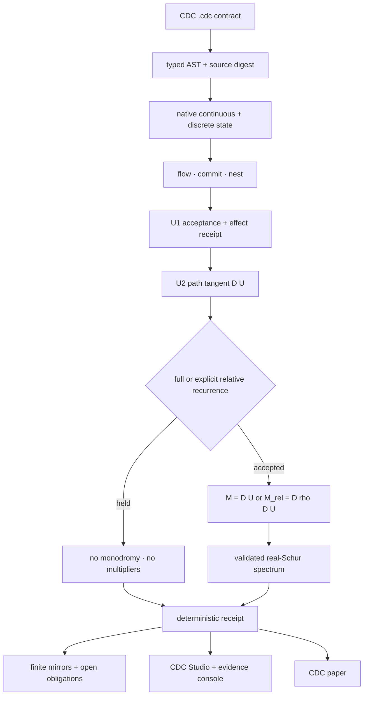

# BiDi Universal Operator System

BiDi gives a transformation one continuous life across source, state,
execution, variation, verification, and presentation. As a **Universal
Operator System**, it can express a transformation, execute it as state change,
differentiate its path, test whether a return has actually occurred, and bind
every accepted or held result to evidence. The Coherence-Delta Calculus (CDC)
is its formal source language, native kernel, and canonical `.cdc` contract.

It exists to close a familiar break in ambitious technical systems:
description, execution, analysis, and explanation are split into separate
languages, then asked to trust that they still refer to the same event. BiDi
keeps them on one operator path. Runtime, guarded operators, variational
analysis, receipts, finite proof mirrors, instruments, and paper become
different working views of that shared path.

## One system, stable parts

- **BiDi:** integrated repository, operator system, and evidence surface.
- **CDC:** formal language, native kernel, and canonical `.cdc` contract.
- **U1:** guarded lifted-cover acceptance and effect authorization.
- **U2:** source-bound tangent plus recurrence-gated return analysis.
- **Möbius:** embodied reference instrument over system receipts.
- **`𝒰_` / `𝒰`:** complete executable sigil and reduced mathematical body.
- **RFTC:** bounded classical reference-frame research lane.

The stable compatibility surface remains CDC: the `cdc` command, `.cdc` files,
package name, ABI, C symbols, and Lean/Rocq namespaces do not change when the
repository is described at the system level.

## A reciprocal build loop

BiDi grew because Edward Ellis's theories and products repeatedly surfaced gaps
between an idea, a formal contract, an executable path, and inspectable
evidence. Each pass turned one of those gaps into shared operator machinery;
each verified refinement then returned to the originating work as a stronger
mechanism, constraint, instrument, or falsifiable question.

The [origin and evolution](ORIGIN_AND_EVOLUTION.md) records that progression
from the first calculus and native reducer through U1, product instruments,
durable receipts, cross-system interfaces, and U2 recurrence analysis.

## The operator path



The path is deliberately one-way in authority. Source can authorize
execution; execution can authorize a tangent; recurrence can authorize a return
operator; validated linear algebra can authorize a spectrum. Nothing moves
backward merely because a diagram, screen, or interpretation is compelling.

## Layer 1: CDC source and native kernel

CDC defines the executable contract. Its primitive operational vocabulary is
small:

1. `flow(d)` advances phase state synchronously for a declared duration;
2. `commit(m)` maps phase to the balanced-ternary carrier and gates the event;
3. `nest(parent, child)` executes the audited bidirectional cross-scale update.

Frameworks, traces, persistence, U1, and U2 are derived declarations and jobs.
The parser, registry, reducer, store, receipts, and U1/U2 implementation are
native C and consume the same canonical `.cdc` source. `cdc_boot.py` is a
minimal, frozen declaration/expectation oracle used for parity checks; it is not
the semantic runtime.

The calculus-level specification is intentionally larger than native
realization v1. A declaration for amplitude, delay, projected lines, precision,
plasticity, or a richer guard is not silently treated as executed dynamics.
The formal semantic spine records which fields are consumed, frozen,
observational, or still obligations.

## Layer 2: state, effects, and durability

The native state is hybrid:

- continuous coordinates include cell phases and module belief/prior values;
- discrete state includes latch presence, balanced-ternary values, and event itinerary;
- derived observations include projection, winding, sheet, and holonomy; and
- effects are admitted only after their source decision passes its guard.

Persistence uses the same admissibility barrier as in-memory commitment. A held
decision cannot reach the store. Durable-byte identity and replay identity are
separate receipts so compaction can change storage without rewriting semantic
history.

## Layer 3: U1 guarded acceptance

U1 is a derived job, not a fourth primitive. For the canonical two-turn path it
checks:

- receptive and radiant roles are correctly oriented and active;
- one lifted turn returns the projection on the opposite sheet;
- two turns return the projection with the sheet restored;
- observed and declared holonomy agree;
- each local commit accepts;
- computed record and decision coordinates agree; and
- the effect path enacts only that computed decision.

Passing these conditions earns **guarded lifted-cover closure**. It does not
erase the rest of the runtime state or imply that every coordinate and mode has
returned.

## Layer 4: U2 variation and recurrence

U2 differentiates the accepted native itinerary rather than an idealized
surrogate. It:

1. closes the coordinate manifest over the exact executed path;
2. composes analytic derivatives in source/event order;
3. records complete continuous and discrete endpoints;
4. tests full recurrence or an explicitly declared relative restoration;
5. constructs `M = D U` or `M_rel = D rho D U` only after that gate; and
6. computes deterministically ordered multipliers through a validated real-Schur backend.

The canonical `framework_loop.cdc` source earns its tangent and then holds. Its
unwrapped phase advances by `4 pi`; latches populate; context belief and child
prior change. Since the full return contract fails, the receipt contains no
monodromy and no multipliers.

The positive calibration fixture isolates the cover and supplies the endpoint
restoration `rho(theta) = theta - 4 pi` with a complete identity derivative.
That bounded fixture earns a relative identity monodromy and marginal spectrum.
It validates the gate mechanism, not the stability of the canonical task loop
or a physical system.

## Apertured oriented reciprocity

Polarity is a cross-layer design invariant, not one universal toggle.
BiDi keeps four transformations distinct:

1. **Carrier polarity:** `-1` and `+1` exchange while the aperture `0` is fixed.
2. **Channel polarity:** receptive and radiant endpoints exchange roles.
3. **Path orientation:** angular traversal may reverse.
4. **Cover parity:** one turn changes sheet; two turns restore it.

This separation is necessary. The word `+-` passes the nonnegative-prefix
barrier, while its naive pointwise sign inverse `-+` does not. Carrier inversion
therefore cannot be assumed to preserve every guarded path. A polarity claim is
accepted only for a declared operator/conjugate pair with both primal and
tangent covariance receipts.

Within those bounds, apertured oriented reciprocity is universal to the
**architecture**. Every layer must preserve the distinction between opposed
directions, the neutral aperture, orientation, and cover parity when those
objects are present. It is not universal as an empirical law, and the system
does not force polarity onto an operator whose contract does not contain it.

## Evidence and claim authority

Every public claim is evaluated as:

```text
(scope, maturity, verdict, receipt-or-obligation)
```

### Maturity

- **specified:** defined mathematically or contractually;
- **executed:** produced by the current implementation;
- **adversarially verified:** survived positive, negative, drift, or mutant gates;
- **mechanized finite:** checked in the exact finite Lean/Rocq statement named.

### Verdict

- **accepted:** the scoped gate passed;
- **held:** required authority was absent, ambiguous, or non-returning;
- **violated:** a declared invariant failed;
- **not emitted:** a downstream artifact was correctly withheld.

Maturity and verdict are independent. A recurrence hold can be adversarially
verified when false recurrence is reliably refused. A finite proof can be
accepted while a continuous or physical claim remains completely open.

### Authority order

1. canonical source and executed machine receipt;
2. permanent adversarial and reproducibility gates;
3. versioned language/ABI contract;
4. mathematical specification and finite formal mirror;
5. product rendering, diagram, prose, and interpretation.

Higher-numbered surfaces explain lower-numbered evidence; they cannot promote
it.

## Formal mirrors

Lean and Rocq mechanize the precisely named finite carrier, event-order,
cone-role, sheet-parity, fixed-aperture, and prefix-barrier statements included
in the release gate. They do not prove:

- the continuous Jacobian of every possible CDC realization;
- recurrence of the canonical two-turn runtime state;
- correctness of an arbitrary numerical eigensystem;
- a universal physical polarity law;
- biological completeness; or
- a quantum implementation.

The executable and formal layers meet through explicit obligations, not by
sharing vocabulary alone.

## Instruments and projections

CDC Studio and the web evidence console are product surfaces over the same
receipt vocabulary. They may render source, topology, state, acceptance,
recurrence, and spectra, but they do not create those results. Loading, empty,
held, unavailable, permission-restricted, disabled, and failed states must
remain distinguishable from passing or accepted states.

Möbius is the embodied reference instrument. Its connected eye-bearing form,
one-turn/two-turn motion, and `𝒰_` opening make the cover relation visible.
Those assets are explanatory projections. They are not a proof of runtime
behavior or a physical Möbius/spinorial ontology. The wordmark **Möbi𝒰s**
remains proposed until accepted as a product-linked identity.

## Research lanes

RFTC explores deterministic classical machinery for synchronization, oriented
winding, hidden-state provenance, local/macro recovery, admissibility, record
closure, and causal cuts. Its crucible and ABI are evidence-bearing research
artifacts, but they do not establish multi-host deployment, a physical qubit,
entanglement, nonlocality, or quantum advantage.

Future physical, biological, or cosmological interpretations require domain
state variables, units, calibration, alternative models, independent data, and
discriminating experiments. They remain hypotheses until those obligations are
met.

## Repository routes

- [README](README.md): public front door, run path, current state, and boundaries.
- [Origin and evolution](ORIGIN_AND_EVOLUTION.md): theory-product feedback loop and repository history.
- [CDC language](CDC_LANGUAGE.md): syntax and canonical source contract.
- [Formal semantic spine](FORMAL_SEMANTIC_SPINE.md): specified versus executed semantics.
- [Frameworks](FRAMEWORKS.md): H1–H6 task vocabulary and bindings.
- [Verification matrix](VERIFICATION_OBLIGATION_MATRIX.md): exact claims and receipts.
- [U2 semantics](docs/u2/U2_SEMANTICS.md): normative variational/recurrence protocol.
- [Polarity audit](docs/u2/POLARITY_AUDIT.md): invariants, counterexamples, and open obligations.
- [CDC Studio and console](ui/README.md): operator surfaces.
- [RFTC matrix](docs/rftc/VERIFICATION_OBLIGATION_MATRIX.md): bounded classical research lane.
- [Identity source](docs/identity/README.md): visual and motion provenance.
- [CDC paper](paper/arxiv/main.pdf): formal kernel and U1/U2 release argument.

## Compatibility contract

The system name changes no executable or source identity:

- Python package: `bidi-coherence-delta-calculus`;
- executable and command family: `cdc`;
- source extension: `.cdc`;
- native ABI and symbols: `CDC_*` / `cdc_*`;
- formal namespaces: existing Lean and Rocq modules;
- receipt schemas: existing versioned `cdc.*` identifiers.

The repository may evolve above these surfaces without breaking them. A future
breaking change requires an explicit versioned migration rather than a branding
rewrite.
