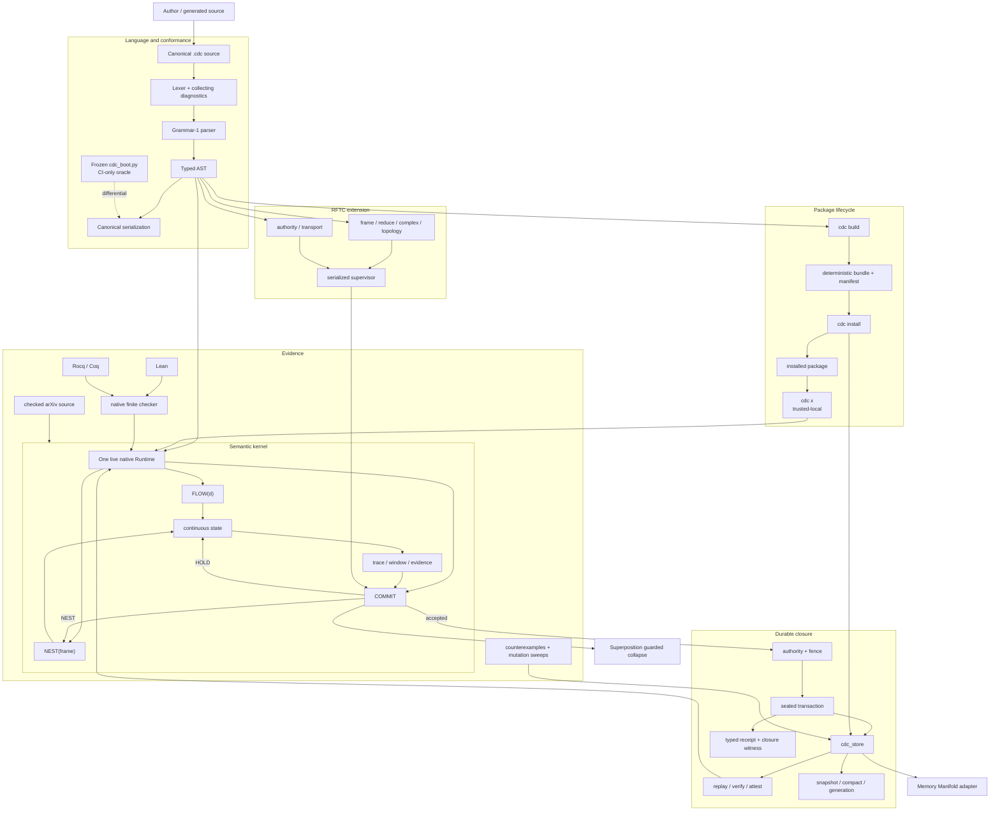
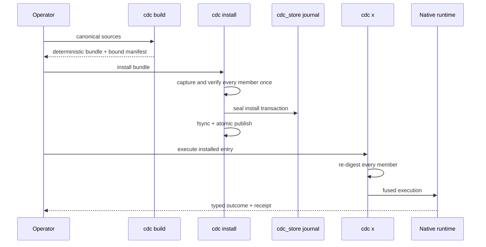

# CDC system flow

This document is the bird's-eye view of the current repository. It separates
the formal kernel, language/toolchain, durable runtime, and downstream product
adapters so that a claim at one layer cannot silently promote another.

## Complete executable path



## Responsibility boundaries

| Layer | Owns | Does not own |
| --- | --- | --- |
| Formal kernel | carrier, FLOW/COMMIT/NEST, invariants, frame coupling | networking, application schemas, device placement |
| `.cdc` language | canonical declarations, typed diagnostics, execution contracts | downstream product UX |
| Native runtime | execution, evidence, guarded decision, typed outcomes | silent policy defaults |
| `cdc_store` | sealed history, replay, recovery, coordination, fencing | authorization by itself |
| Package lifecycle | deterministic bundles, crash-safe install, verified local execution | hostile-package sandboxing or network registry |
| RFTC | bounded frame/topology/authority/transport contracts | nonclassical or quantum claims |
| Memory Manifold | memory schema, traversal, derived geometry, consolidation | rewriting CDC decision semantics |
| Superposition | distributed state, placement, speculative fan, effect realization | inventing COMMIT authority |

## One guarded mutation

The same invariant must hold whether the effect is a local state latch, a memory
append, a package install, or a speculative result:

```text
candidate
  -> derive evidence
  -> evaluate policy and invariant
  -> COMMIT | HOLD | NEST | FAIL
  -> on COMMIT only: fence
  -> seal decision and effects
  -> expose receipt / closure witness
```

No wrapper, adapter, migration helper, or "internal" store caller may create a
second durable path.

## Flow, state, and observation

FLOW evolves live state. A trace/window reads a bounded projection of that
evolution. COMMIT closes a typed distinction only at a guard boundary. NEST
changes which reference frame honestly carries the unresolved interaction.

This supports continuous, discrete, and scale-relative behavior without
converting every observation into a global clock tick or every HOLD into a
failure.

## Durability and replay

`cdc_store` distinguishes:

```text
valid unsealed tail     -> recover to last seal
corrupt sealed prefix  -> fail closed, preserve evidence
I/O fault              -> typed I/O error, never truncate
```

Snapshot and compaction are one atomic generation transition. Replay identity
survives compaction; byte-level attestation changes because representation
changed. Whole-file rollback is visible only to an external retained anchor,
which remains an open signing/operations lane.

## Package path



`cdc x` remains trusted-local. The diagram does not imply a sandbox, remote
registry, dependency solver, or version lockfile.

## RFTC control plane

RFTC extends the language with six non-colliding forms:

```text
frame -> reduce -> complex -> topology -> authority -> transport
```

ABI 1.4 currently binds action, horizon, causal state, recipient, and payload
into canonical keyed-BLAKE3 envelopes; consumes bounded authority leases; and
serializes supervisor admission. This is a local cross-process control-plane
proof. Public-key identity, key rotation, sessions across untrusted networks,
quorum certificates, recursive cells, and cross-host reconciliation are next
mechanisms, not inferred capabilities.

## Evidence ladder

1. **Definition:** formal text or schema says what should happen.
2. **Construction:** runtime provides a path that can do it.
3. **Counterexample:** a deliberately broken path turns the gate red.
4. **Execution:** the exact source and binary pass the gate.
5. **Integration:** downstream adapters cannot bypass or weaken it.
6. **Field evidence:** separate hardware and real conditions preserve it.

The repository is strong through execution for its local native surfaces.
Memory Manifold integration and Superposition field execution remain separate
gates.

The static version of this flow is
[`../../assets/architecture/cdc-system-flow.svg`](../../assets/architecture/cdc-system-flow.svg).
