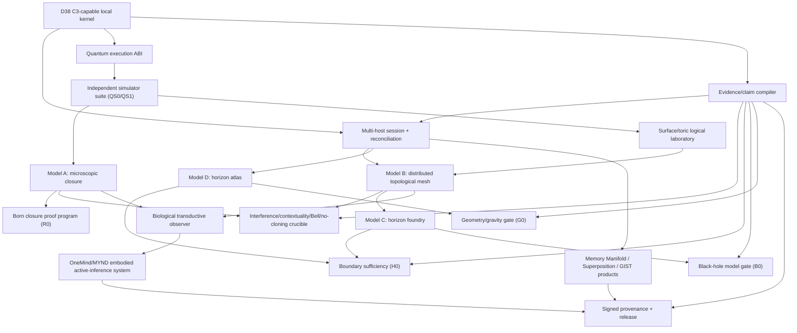

# Relational Closure End-State Execution Plan

Status: **binding dependency graph for the expanded production/research
mission; completion is evidence-defined, not date-defined**

## 1. End state

Ship one production-grade Relational Closure Compute System containing:

- canonical language, calculus, native ABI, and runtime;
- authenticated multi-host reference-frame/topological execution;
- recursive logical cells and supervised scheduling;
- quantum execution ABI with independently validated simulators;
- surface/toric-code logical-qubit laboratory;
- honest classical, simulator, circuit-cut, and QPU backends;
- Models A-D for microscopic, distributed, foundry, and horizon-atlas closure;
- R0 probability derivation and proof packet;
- biological transductive-observer/AI architecture;
- Memory Manifold, Superposition, GIST/Cortex, MYND/OneMind integrations;
- SDKs, operator surfaces, packages, evidence compiler, and release artifacts;
- physical experiment specifications capable of adjudicating Q0, B0, and G0.

No external credential, hardware absence, null scientific result, or failed
hypothesis reduces the software end state. It selects the honest claim and
shipping configuration.

## 2. Dependency graph



## 3. Work lanes

### Lane 0 — evidence compiler and authority

Runs continuously and has veto authority over promotion:

- machine-readable claim schema;
- substrate/claim compatibility checks;
- evidence manifests and provenance;
- preregistered thresholds;
- negative-control detection;
- resource ledgers;
- exact-head CI and independent review.

### Lane 1 — distributed C3

- network-session identity and key rotation;
- real multi-process/multi-host driver;
- partitions, asymmetric partitions, reordering, duplication, delay;
- mixed versions;
- configuration-epoch reconciliation;
- authority-preserving recovery;
- operator surface bound to real receipts;
- cross-host replay receipt.

### Lane 2 — quantum ABI and QS

- typed state preparation, operations, measurement, conditioning, noise;
- backend-neutral circuit/job/result contracts;
- deterministic exact and stochastic simulators;
- tensor-network/stabilizer/surface-code comparators;
- independent reference oracles;
- mutation, fuzz, sanitizer, resource, and reproducibility gates.

### Lane 3 — R0 and Model A

- closure-measure axiom formalization;
- alternative probability measures and countermodels;
- interference/which-record sweep;
- contextuality and Bell operational models;
- no-cloning structure;
- formal and executable uniqueness work.

### Lane 4 — toric/surface and Model B

- stabilizer checks and syndrome records;
- logical sectors and transformations;
- local/correlated/burst/leakage noise;
- threshold estimation without fitted promotion;
- distributed decoders and topology-destroyed controls;
- end-to-end logical task/resource benchmarks.

### Lane 5 — Models C and D

- closure-foundry engine;
- boundary capacity;
- interior/exterior access enforcement;
- emission/backreaction and information metrics;
- overlapping frame atlas;
- translation, horizons, overlap consistency, and holonomy;
- matched global-ledger/hard-coded/volume/area controls.

### Lane 6 — biological observer and AI

- typed body/sensor/actuator boundary;
- hybrid continuous/discrete state;
- endogenous clocks and homeostatic variables;
- valence and active inference;
- self-model and multiscale closure;
- causal environmental return;
- matched predictor/recurrent/embodied comparators.

### Lane 7 — product and release

- SDKs and schemas;
- web/macOS/operator surfaces;
- Memory Manifold and Superposition bindings;
- GIST/Cortex and MYND/OneMind bindings;
- packages, examples, tutorials, migration;
- clean-machine builds and signed release artifacts.

## 4. Baton orchestration

The lead agent owns:

- architecture;
- branch/write ownership;
- invariant changes;
- integration;
- claim promotion;
- destructive/external actions;
- final verification.

Fast/light workers may own bounded read-only or isolated tasks:

- source maps and terminology normalization;
- test inventory;
- counterexample generation;
- dependency mapping;
- literature theorem retrieval;
- fixture/control generation;
- log/result triage;
- documentation consistency scans.

Workers return **task-shaped receipts**. A response that does not address its
assignment earns no completion status. No worker self-merges, relaxes a gate,
or promotes a claim.

## 5. Parallelism rules

- one writer per file/worktree;
- independent reviewers never edit the reviewed surface;
- proof, implementation, and adversarial-control authors are separated where
  practical;
- a model's output is candidate source until compiled/tested;
- failed or distracted worker outputs are retried with narrower contracts;
- critical-path work continues locally while workers map adjacent work;
- expensive models are reserved for architecture, proof gaps, failed gates,
  and synthesis.

## 6. Promotion sequence

```text
C2
-> C3-capable local kernel
-> C3 multi-host
-> C4 classical advantage (if earned)

QS0
-> QS1
-> QH0
-> Q0 physical witness
-> Q1 accepted advantage

R0 independently
H0 independently
B0 independently
G0 independently
```

The biological/AI architecture and consciousness hypothesis use their own
mechanism/evidence verdicts and cannot inherit Q0, G0, or N0.

## 7. Completion receipts

Each lane closes only with:

- requirement-to-evidence matrix;
- exact source identity;
- build/test commands and logs;
- counterexample corpus;
- mutation/fuzz/sanitizer/concurrency results as applicable;
- resource/scale results;
- independent permission-to-block review;
- user-facing artifact;
- machine-readable verdict;
- explicit exclusions and remaining physical/external gates.

## 8. Time posture

Engineering stages can advance in parallel over hours to weeks depending on
gate failures and external integrations. Genuine Q0/B0/G0 physical claims may
require hardware, independent laboratories, and substantially longer
experimental cycles. Duration never changes the end state or permits a
simulation to borrow the authority of a physical result.
