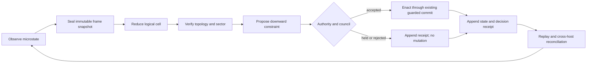

# Reference-Frame Topological Coherence — Full Build Specification

Status: **C1-C2 runtime core active; parser-level six-form and distributed C3
implementation gated on the crucible verdict**

## 1. End state

BiDi becomes a distributed, authority-preserving field-computation runtime in
which:

1. physical or simulated nodes publish phase-bearing microstate;
2. a versioned frame reducer groups those nodes into logical cells;
3. every logical cell exposes a typed macrostate:
   order amplitude `R`, mean phase `Psi`, dispersion, oriented boundary,
   winding sector, hidden-state class digest, causal horizon, and freshness;
4. guarded commitments occur against that macrostate without destroying the
   underlying microstate provenance;
5. top-down constraints flow back to eligible nodes through explicit authority
   leases;
6. cells nest recursively and bridge across hosts using the same receipt,
   replay, and ternary decision semantics already proven in BiDi;
7. a web/macOS operator surface presents live state, rejected actions,
   topology, causal cuts, provenance, and replay without inventing data.

The target is not a software imitation of a quantum computer. It is a real
classical topological field computer with an explicit interface through which a
future physical nonclassical substrate could participate without changing the
semantic core.

The constitutive flow/record/closure contract is frozen in
[`RELATIONAL_RECORD_CLOSURE.md`](RELATIONAL_RECORD_CLOSURE.md).

## 2. Core invariant

For every logical cell `C` and replay position `t`:

```text
microstates(C,t)
  --reduce(frameVersion, topologyVersion)-->
macrostate(C,t)
  --guard(policy, authority, causalHorizon)-->
decision(C,t)
  --enact(receipt)-->
microstates(C,t+1)
```

The replayed reduction must byte-match the recorded macrostate and the enacted
coordinate must match the accepted decision coordinate. A held or rejected
decision creates no state mutation.

## 3. Six-form RFTC language layer

These forms extend the existing parser and AST. They do not create a second
runtime language. Capability identifiers are intentionally unassigned here:
decision D3 reserves H12-H17 for Memory Manifold, so the RFTC lane must receive
new registry identifiers through an explicit registry amendment rather than
silently reuse them.

### `frame`

Declares scale, membership, sampling window, clock discipline, and reduction
version.

```cdc
frame cortical-column
  scale=mesoscopic
  members=node/*
  window=50ms
  clock=hybrid-logical
  reducer=rftc-v1
```

### `reduce`

Computes the macrostate and hidden equivalence class from an immutable input
snapshot.

```cdc
reduce cortical-column
  outputs=R,Psi,dispersion,winding,classDigest,freshness
  minimum-members=16
  stale-after=150ms
```

### `complex`

Defines oriented adjacency and boundary ownership for a logical cell.

```cdc
complex column-ring
  frame=cortical-column
  orientation=clockwise
  adjacency=ring
  boundary=closed
```

### `topology`

Declares protected sectors, admissible local deformation, and the event that
constitutes a sector change.

```cdc
topology phase-sector
  complex=column-ring
  invariant=winding
  allowed=local-continuous
  transition=phase-slip
```

### `authority`

Allocates who may observe, propose, commit, enact, bridge, or revoke. Every
capability is scoped to a frame, horizon, expiry, and nonce.

```cdc
authority cell-controller
  frame=cortical-column
  permits=observe,propose
  enact=quorum:3/5
  expires=2026-07-29T00:00:00Z
```

### `transport`

Moves signed observations, proposals, decisions, and receipts between hosts.
Transport never supplies a parallel semantic path.

```cdc
transport lab-mesh
  protocol=quic-mtls
  schema=rftc-wire-v1
  replay=rftc-replay-v1
  partition=hold
```

## 4. Runtime components

| Module | Responsibility | Failure posture |
|---|---|---|
| `cdc_frame` | membership snapshots, clock/freshness, reducer dispatch | stale or incomplete frames hold |
| `cdc_topology` | oriented complexes, winding, sector transitions | ambiguous orientation or boundary rejects |
| `cdc_authority` | leases, scopes, quorum, revocation, nonce defense | missing/expired/duplicate authority rejects |
| `cdc_transport` | authenticated envelopes, retry, deduplication, causal ordering | partition or schema mismatch holds |
| existing store | append, snapshot, recovery, digest, replay | current fail-closed semantics retained |
| existing bridge/council | cross-cell routing and guarded collective decision | no direct state mutation |
| existing universal operator | lifted closure and enacted-coordinate agreement | remains derived, not foundational |
| `cdc_rftc` | immutable oriented-frame reduction, macrostate, topology sector, microstate and state provenance | malformed or underspecified frames reject |
| `cdc_shared_record` | fragment publication and quorum recovery through sealed store history | missing quorum, duplicate fragments, conflict, corruption, or compacted payload loss reject |
| `cdc_barrier` | shared balanced-ternary prefix-admissibility kernel | invalid carrier or negative prefix rejects |

Fixed-size runtime arrays are replaced with bounded dynamic collections carrying
explicit allocation limits. Every public operation is available through the
native ABI before a network service or UI may depend on it.

## 5. Data contracts

### `FrameSnapshot`

```text
frameId, frameVersion, reducerVersion, topologyVersion,
memberIds[], observationDigests[], logicalClock,
windowStart, windowEnd, freshness, snapshotDigest
```

### `LogicalCellState`

```text
cellId, frameSnapshotDigest, R, Psi, dispersion,
orientedBoundaryDigest, winding, sector,
hiddenClassDigest, memberCount, causalHorizon, stateDigest
```

### `ControlProposal`

```text
proposalId, cellStateDigest, targetSelector, fieldConstraint,
authorityLeaseId, nonce, expiry, proposalDigest
```

### `DecisionReceipt`

```text
proposalDigest, ternaryDecision, reason, councilEvidence[],
recordCoordinate, decisionCoordinate, enactedCoordinate?,
previousStateDigest, resultingStateDigest?, signature, receiptVersion
```

### Replay envelope

All records use length-delimited, versioned envelopes with an algorithm-tagged
digest, previous-record digest, writer identity, logical clock, and CRC before
the semantic payload. Unknown versions hold rather than downgrade.

## 6. Distributed lifecycle



Membership change is a frame-version transition. Partitioned hosts may continue
to observe and append local evidence but cannot enact a distributed decision
unless its declared quorum and causal horizon remain valid.

## 7. Claim ladder

Every artifact and UI surface carries one of these machine-readable levels:

| Level | Permitted statement | Required evidence |
|---|---|---|
| C0 | deterministic classical simulation | reproducible trajectories |
| C1 | collective field computation | critical-coupling sweep and negative controls |
| C2 | topologically classified logical cells | oriented boundary, invariant preservation, phase-slip transition |
| C3 | distributed BiDi logical-cell runtime | authenticated receipts, partitions, recovery, cross-host replay |
| C4 | useful classical computational advantage | matched workload benchmarks against accepted baselines |
| Q0 | nonclassical physical witness | loophole-aware physical experiment, independent analysis |
| Q1 | quantum computational advantage | accepted task and classical-resource comparison |

The current seven-witness executable crucible targets C1-C2. Its per-event
admissibility witness uses the same barrier as native and persistent commits,
then observes durable store and typed-receipt effects. Its distributed-record
witness closes and reopens independent fragment stores and recovers only
through their authenticated sealed payloads. Parser-level forms, network
transport, distributed authority, and recursive cross-host execution remain
the C3 build. No software stage can self-promote to Q0 or Q1.

## 8. Full verification matrix

### Semantic and topology

- parser/AST round trips for all six RFTC forms;
- golden and malformed fixtures for every field;
- property tests for phase-wrap, ordering, and orientation;
- local-deformation preservation and explicit phase-slip transitions;
- reducer determinism across input permutations allowed by the topology;
- hidden-class collisions treated as evidence aliases, never identity equality.

### Authority and adversarial operation

- expired, revoked, wrong-frame, wrong-horizon, replayed, and duplicated leases;
- conflicting councils and equivocation evidence;
- malicious host forging membership, freshness, clocks, or topology versions;
- deny-by-default capability matrix and complete audit receipts.

### Transport and recovery

- packet loss, duplication, reordering, delay, partition, asymmetric partition;
- process crash at every append/snapshot/rename boundary;
- torn writes, disk-full, permission loss, transient read faults;
- schema upgrade/downgrade and mixed-version clusters;
- deterministic replay from every accepted checkpoint.

### Scale and performance

- 32, 256, 4,096, and 65,536 nodes;
- nested cells at 1, 2, 4, and 8 levels;
- p50/p95/p99 reduction and enactment latency;
- memory bounds under hostile membership churn;
- sustained soak, thermal throttling, and reconnect storms;
- matched one-way/local and BiDi controls.

### Product surface

- every displayed value binds to a signed runtime record;
- stale, partitioned, held, and rejected states are visually distinct;
- keyboard, screen-reader, contrast, reduced-motion, and narrow-screen gates;
- file, live-stream, and replay modes yield the same rendered verdict;
- no UI action can bypass the native authority/commit path.

## 9. Execution sequence and hard gates

1. **RFTC crucible:** seven independent witnesses under deterministic replay,
   alternate seed, sanitizers, rapid, and stress.
2. **Local semantics:** `frame` / `reduce` / `complex` / `topology` parser,
   AST, reducer, logical cell, topology.
3. **Durable truth:** versioned state/receipt replay and crash recovery.
4. **Authority:** H16 leases, quorum, revocation, adversarial suite.
5. **ABI completion:** every operation callable and fail-closed in-process.
6. **Distribution:** `transport` authenticated transport, partition semantics,
   reconciliation, mixed-version operation.
7. **Recursive cells:** nesting, bridge/council integration, universal closure.
8. **Operator surfaces:** web/macOS binding to actual records.
9. **Production crucible:** scale, soak, fault injection, security review,
   independent replay, artifact provenance.

No later stage waives an earlier gate. A failing stress result reopens the
owning mechanism rather than being relabeled as an operational limitation.

## 10. Immediate next-hours protocol

Run:

```sh
./scripts/verify_rftc.sh
build/rftc/rftc_crucible --profile rapid
open experiments/rftc/ui/index.html
```

Then ask an independent model to review `CRUCIBLE_CONTRACT.md`,
`verdict.json`, and this specification for:

1. a counterexample that passes a witness without the claimed mechanism;
2. a threshold tuned to the implementation instead of the hypothesis;
3. a hidden communication or observation channel;
4. a missing authority, replay, or partition invariant;
5. any statement that crosses from C0-C3 into Q0-Q1 without physical evidence.

Only a clean rapid run plus resolved independent objections opens integrated
six-form implementation.
