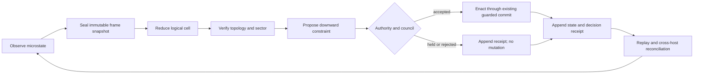

# Reference-Frame Topological Coherence — Full Build Specification

Status: **C1-C2 runtime core and C3 language/control-plane merged; ABI 1.5
local durable recursive execution kernel implemented under D37-D38; actual
multi-host session, cross-host reconciliation, and C3 evidence remain gated**

## 1. End state

BiDi becomes a distributed, authority-preserving field-computation runtime in
which:

1. physical or simulated nodes publish phase-bearing microstate;
2. a versioned frame reducer groups those nodes into logical cells;
3. every logical cell exposes a typed macrostate:
   order amplitude `R`, mean phase `Psi`, dispersion, oriented boundary,
   winding sector, hidden-state class digest, causal horizon, and freshness;
4. guarded commitments occur against that macrostate without destroying the
   underlying microstate provenance;
5. top-down constraints flow back to eligible nodes through explicit authority
   leases;
6. cells nest recursively and bridge across hosts using the same receipt,
   replay, and ternary decision semantics already proven in BiDi;
7. a web/macOS operator surface presents live state, rejected actions,
   topology, causal cuts, provenance, and replay without inventing data.

The target is not a software imitation of a quantum computer. It is a real
classical topological field computer with an explicit interface through which a
future physical nonclassical substrate could participate without changing the
semantic core.

The constitutive flow/record/closure contract is frozen in
[`RELATIONAL_RECORD_CLOSURE.md`](RELATIONAL_RECORD_CLOSURE.md).

## 2. Core invariant

For every logical cell `C` and replay position `t`:

```text
microstates(C,t)
  --reduce(frameVersion, topologyVersion)-->
macrostate(C,t)
  --guard(policy, authority, causalHorizon)-->
decision(C,t)
  --enact(receipt)-->
microstates(C,t+1)
```

The replayed reduction must byte-match the recorded macrostate and the enacted
coordinate must match the accepted decision coordinate. A held or rejected
decision creates no state mutation.

## 3. Six-form RFTC language layer

These forms extend the existing parser and AST. They do not create a second
runtime language. Decision D35 assigns the non-colliding `R1-R6` capability
range to this lane; D3's H12-H17 Memory Manifold reservation remains untouched.

### `frame`

Declares scale, membership, sampling window, clock discipline, and reduction
version.

```cdc
frame cortical-column
  scale=mesoscopic
  members=node/*
  window=50ms
  clock=hybrid-logical
  reducer=rftc-v1
```

### `reduce`

Computes the macrostate and hidden equivalence class from an immutable input
snapshot.

```cdc
reduce cortical-column
  outputs=R,Psi,dispersion,winding,classDigest,freshness
  minimum-members=16
  stale-after=150ms
```

### `complex`

Defines oriented adjacency and boundary ownership for a logical cell.

```cdc
complex column-ring
  frame=cortical-column
  orientation=clockwise
  adjacency=ring
  boundary=closed
```

### `topology`

Declares protected sectors, admissible local deformation, and the event that
constitutes a sector change.

```cdc
topology phase-sector
  complex=column-ring
  invariant=winding
  allowed=local-continuous
  transition=phase-slip
```

### `authority`

Allocates who may observe, propose, commit, enact, bridge, or revoke. Every
capability is scoped to a frame, horizon, expiry, and nonce.

```cdc
authority cell-controller
  frame=cortical-column
  permits=observe,propose
  enact=quorum:3/5
  expires=2026-07-29T00:00:00Z
```

### `transport`

Moves signed observations, proposals, decisions, and receipts between hosts.
Transport never supplies a parallel semantic path.

```cdc
transport lab-mesh
  protocol=quic-mtls
  schema=rftc-wire-v1
  replay=rftc-replay-v1
  partition=hold
```

## 4. Runtime components

| Module | Responsibility | Failure posture |
|---|---|---|
| `cdc_frame` | membership snapshots, clock/freshness, reducer dispatch | stale or incomplete frames hold |
| `cdc_topology` | oriented complexes, winding, sector transitions | ambiguous orientation or boundary rejects |
| `cdc_authority` | bounded versioned leases, subject/frame/action/horizon scope, local quorum input, expiry/revocation, nonce and forged-ticket defense | missing, wrong-scope, expired, revoked, replayed, or stale authority rejects |
| `cdc_transport` | canonical versioned envelope, MAC-bound action/horizon/payload, recipient/key/schema checks, deduplication and causal order | partitions, duplicates, gaps, and parent mismatch hold; tamper/replay rejects |
| `cdc_supervisor` | one mutex-owned authenticate → authority → reserve → typed application verdict → consume/accept transaction | holds remain exactly retryable; terminal semantic rejects consume poison positions without application mutation; concurrent duplicate commits once |
| `cdc_cell` | reduce one sealed frame into a provenance-bound logical-cell state and canonically revalidate exported/imported state | old clocks, version regression, unwitnessed topology/frame transitions, and state-digest/lineage tampering reject |
| `cdc_scheduler` | freeze a bounded cell forest, atomically migrate predecessor-bound configuration epochs, and process canonical observation/witness order through recursive barriers | pre-seal publication, graph mutation, child rebinding, mixed predecessor lineage, receipt tampering, conflicting duplicates, incomplete child epochs, and capacity overflow fail closed |
| `cdc_scheduler_wire` | canonical bounded `CDCP` v1 observation/witness encoding | noncanonical phase aliases, reserved bits, truncation, trailing bytes, malformed evidence, and oversized payloads reject |
| `cdc_scheduler_journal` | seal canonical outcome plus complete signed envelope and reconstruct fresh schedulers from exact authenticated history under the configured peer policy | storage failure holds without authority consumption; wrong peer policy/key/corruption mutate no scheduler; terminal poison remains causal without app mutation; compacted history is non-executable and refused |
| existing store | append, snapshot, recovery, digest, replay | current fail-closed semantics retained |
| existing bridge/council | cross-cell routing and guarded collective decision | no direct state mutation |
| existing universal operator | lifted closure and enacted-coordinate agreement | remains derived, not foundational |
| `cdc_rftc` | immutable oriented-frame reduction, macrostate, topology sector, microstate and state provenance | malformed or underspecified frames reject |
| `cdc_shared_record` | fragment publication and quorum recovery through sealed store history | missing quorum, duplicate fragments, conflict, corruption, or compacted payload loss reject |
| `cdc_barrier` | shared balanced-ternary prefix-admissibility kernel | invalid carrier or negative prefix rejects |

Control-plane, frame, cell, scheduler, and replay collections are bounded
dynamic allocations carrying explicit limits. Their public operations are
exported through ABI 1.5 before a network service or UI may depend on them.
Network-session identity and actual cross-host reconciliation remain separate
composition gates.

## 5. Data contracts

### `FrameSnapshot`

```text
frameId, frameVersion, reducerVersion, topologyVersion,
memberIds[], observationDigests[], logicalClock,
windowStart, windowEnd, freshness, snapshotDigest
```

### `LogicalCellState`

```text
cellId, frameSnapshotDigest, R, Psi, dispersion,
orientedBoundaryDigest, winding, sector,
hiddenClassDigest, memberCount, causalHorizon, stateDigest
```

### `ControlProposal`

```text
proposalId, cellStateDigest, targetSelector, fieldConstraint,
authorityLeaseId, nonce, expiry, proposalDigest
```

### `DecisionReceipt`

```text
proposalDigest, ternaryDecision, reason, councilEvidence[],
recordCoordinate, decisionCoordinate, enactedCoordinate?,
previousStateDigest, resultingStateDigest?, signature, receiptVersion
```

### Scheduler command and replay envelope

Scheduler commands use canonical bounded `CDCP` v1 payloads. Durable ingress
stores canonical `CDJR` v1 `ACCEPT`/`REJECT` outcomes wrapping the complete
canonical `RF3W` authenticated envelope, including sender, recipient, frame,
lease, action, horizon, causal parent, payload digest, MAC, and envelope
identity. Restart reconstructs the configured peer and rechecks every policy
and authentication field rather than trusting the store's unkeyed integrity
digest. Unknown or noncanonical versions fail closed; exact recovery refuses a
compacted store because its discarded event bytes cannot be reconstructed from
the retained commitment.

### Configuration epoch receipt

```text
cellId, kind, canonicalCellStructureDigest,
sourceConfigurationDigest, previousLogicalCellState
```

The structure digest binds the oriented ring and, for a composite, the child
cell identifier assigned to each oriented member. The embedded state is
canonically revalidated before import. Every receipt binds the configuration
digest of the sealed scheduler that exported it. A new unsealed scheduler
imports one atomic batch only when every source digest equals the declared
predecessor, then seals a new configuration. Same-frame carry-forward requires
exact structure. A changed cell advances exactly one frame version and
requires a `FRAME_CHANGE` witness before its next commit.

## 6. Distributed lifecycle



Membership change is a frame-version transition. Partitioned hosts may continue
to observe and append local evidence but cannot enact a distributed decision
unless its declared quorum and causal horizon remain valid.

## 7. Claim ladder

Every artifact and UI surface carries one of these machine-readable levels:

| Level | Permitted statement | Required evidence |
|---|---|---|
| C0 | deterministic classical simulation | reproducible trajectories |
| C1 | collective field computation | critical-coupling sweep and negative controls |
| C2 | topologically classified logical cells | oriented boundary, invariant preservation, phase-slip transition |
| C3 | distributed BiDi logical-cell runtime | authenticated receipts, partitions, recovery, cross-host replay |
| C4 | useful classical computational advantage | matched workload benchmarks against accepted baselines |
| QS0/QS1 | typed quantum-simulator semantics and independent simulator validation | quantum ABI, reference oracles, mutation/fuzz/resource evidence |
| QH0 | authentic real-hardware execution receipt | provider identity, job/result/calibration provenance |
| R0 | uniquely derived closure probability measure | formal axioms, uniqueness, alternatives and countermodels |
| Q0 | nonclassical physical witness | loophole-aware physical experiment, independent analysis |
| Q1 | quantum computational advantage | accepted task and classical-resource comparison |
| H0 | executable boundary record-sufficiency mechanism | Models C/D with hidden-global-access controls |
| B0 | black-hole closure foundry reproduces declared information behavior | gravitational model, conservation, emergent turnover, independent audit |
| G0 | emergent geometry/gravity prediction | gauge-invariant observable, accepted-limit recovery, preregistered new prediction |

The seven-witness executable crucible targets C1-C2. Its per-event
admissibility witness uses the same barrier as native and persistent commits,
then observes durable store and typed-receipt effects. Its distributed-record
witness closes and reopens independent fragment stores and recovers only
through their integrity-checked sealed payloads. Parser forms and the
authenticated local control plane, recursive cells, scheduler, and exact
restart journal are implemented. That is a **C3-capable local kernel**, not C3
evidence: actual network-session transport, public-key identity, and
cross-host reconciliation receipts remain in the C3 build. No software stage
can self-promote to Q0 or Q1.

## 7.1 Constitutive research extensions

The runtime semantics are the frozen substrate interface for six separately
gated research programs:

- [`COSMOLOGICAL_RECORD_CLOSURE.md`](COSMOLOGICAL_RECORD_CLOSURE.md) —
  constitutive self-simulation, moving relational center, boundary
  accountability, X dynamic, Models A-D, and H0/B0/G0;
- [`HORIZON_FOUNDRY_SPEC.md`](HORIZON_FOUNDRY_SPEC.md) — typed foundry,
  capacity, provenance, emission, backreaction, and Page-like turnover;
- [`BORN_CLOSURE_DERIVATION.md`](BORN_CLOSURE_DERIVATION.md) — R0 axioms,
  alternative measures, proof obligations, and anti-target-coding controls;
- [`QUANTUM_CLASSICAL_DISSOLUTION_CRUCIBLE.md`](QUANTUM_CLASSICAL_DISSOLUTION_CRUCIBLE.md)
  — interference, contextuality, Bell, no-cloning, and resource accounting;
- [`COSMOLOGICAL_HORIZON_ATLAS_SPEC.md`](COSMOLOGICAL_HORIZON_ATLAS_SPEC.md)
  — overlap consistency, causal translation, closure capacity, relational
  dissipation, and record holonomy;
- [`BIOLOGICAL_TRANSDUCTIVE_OBSERVER_SPEC.md`](BIOLOGICAL_TRANSDUCTIVE_OBSERVER_SPEC.md)
  — organism-boundary transduction, discrete/continuous recursion, active
  inference, valence, self-model, and separately gated consciousness claims.

These documents extend the end state. They do not change the authority of the
current C1-C2/C3-capable evidence. Their ordered implementation and parallel
baton rules are frozen in
[`RELATIONAL_CLOSURE_END_STATE_EXECUTION_PLAN.md`](RELATIONAL_CLOSURE_END_STATE_EXECUTION_PLAN.md).

## 8. Full verification matrix

### Semantic and topology

- parser/AST round trips for all six RFTC forms;
- golden and malformed fixtures for every field;
- property tests for phase-wrap, ordering, and orientation;
- local-deformation preservation and explicit phase-slip transitions;
- reducer determinism across input permutations allowed by the topology;
- hidden-class collisions treated as evidence aliases, never identity equality.

### Authority and adversarial operation

- expired, revoked, wrong-frame, wrong-horizon, replayed, and duplicated leases;
- conflicting councils and equivocation evidence;
- malicious host forging membership, freshness, clocks, or topology versions;
- deny-by-default capability matrix and complete audit receipts.

### Transport and recovery

- packet loss, duplication, reordering, delay, partition, asymmetric partition;
- process crash at every append/snapshot/rename boundary;
- torn writes, disk-full, permission loss, transient read faults;
- schema upgrade/downgrade and mixed-version clusters;
- deterministic replay from every accepted checkpoint.

### Scale and performance

- 32, 256, 4,096, and 65,536 nodes;
- nested cells at 1, 2, 4, and 8 levels;
- p50/p95/p99 reduction and enactment latency;
- memory bounds under hostile membership churn;
- sustained soak, thermal throttling, and reconnect storms;
- matched one-way/local and BiDi controls.

### Product surface

- every displayed value binds to a signed runtime record;
- stale, partitioned, held, and rejected states are visually distinct;
- keyboard, screen-reader, contrast, reduced-motion, and narrow-screen gates;
- file, live-stream, and replay modes yield the same rendered verdict;
- no UI action can bypass the native authority/commit path.

## 9. Execution sequence and hard gates

1. **RFTC crucible:** seven independent witnesses under deterministic replay,
   alternate seed, sanitizers, rapid, and stress.
2. **Local semantics:** `frame` / `reduce` / `complex` / `topology` parser,
   AST, reducer, logical cell, topology.
3. **Durable truth:** versioned state/receipt replay and crash recovery.
4. **Authority:** R5 leases, quorum, revocation, adversarial suite.
5. **ABI completion:** every operation callable and fail-closed in-process.
6. **Recursive cells:** nesting, canonical scheduling, provenance propagation,
   witnessed topology transition, and restart reconstruction.
7. **Distribution:** `transport` network-session transport, partition
   semantics, reconciliation, mixed-version operation, and cross-host replay.
8. **Operator surfaces:** web/macOS binding to actual records.
9. **Production crucible:** scale, soak, fault injection, security review,
   independent replay, artifact provenance.

No later stage waives an earlier gate. A failing stress result reopens the
owning mechanism rather than being relabeled as an operational limitation.

## 10. Immediate next-hours protocol

Run:

```sh
./scripts/verify_rftc.sh
build/rftc/rftc_crucible --profile rapid
open experiments/rftc/ui/index.html
```

Then review `CRUCIBLE_CONTRACT.md`, `verdict.json`, the ABI 1.5 runtime, and
[`VERIFICATION_OBLIGATION_MATRIX.md`](VERIFICATION_OBLIGATION_MATRIX.md) for:

1. a counterexample that passes a witness without the claimed mechanism;
2. a threshold tuned to the implementation instead of the hypothesis;
3. a hidden communication or observation channel;
4. a missing authority, replay, or partition invariant;
5. any statement that crosses from C0-C3 into Q0-Q1 without physical evidence.

Only a clean rapid run plus resolved independent objections opens multi-host
distribution and the later quantum-execution ABI. Local mechanism completion
never promotes its own scientific claim.
